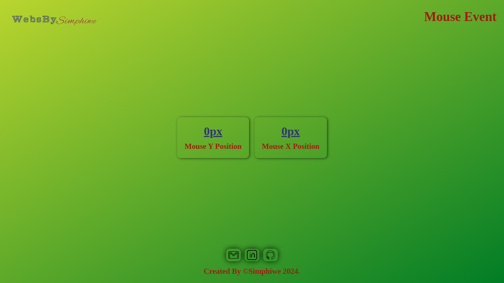
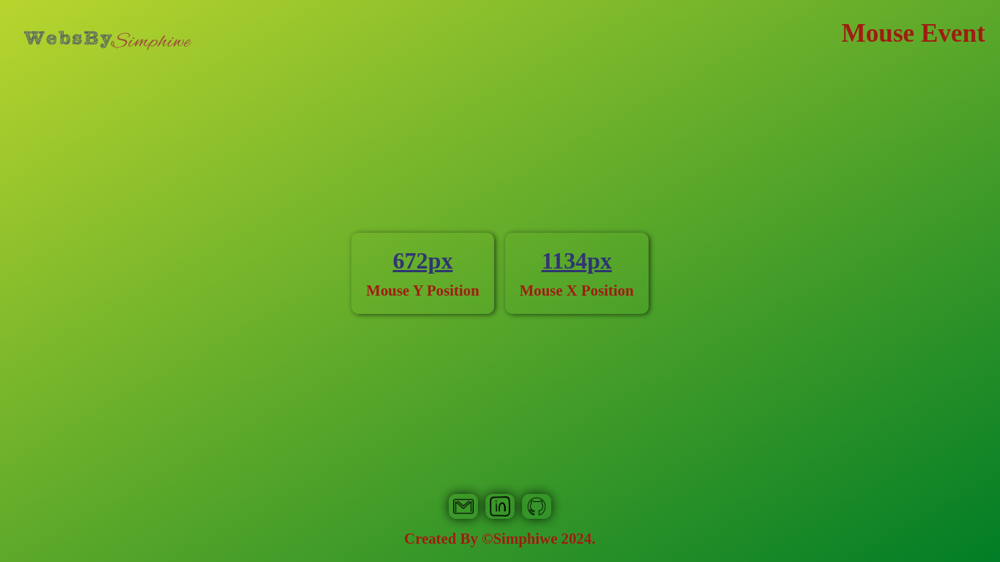

# Mouse Event

Check it _**LIVE**_ 👉
**<https://deebest.github.io/loading-bar/>**

A _**Mouse Event**_ web application I built with HTML,CSS and JavaScript, it track and display the position of the user mouse one the screen. I built it as a part of my JavaScript learning journey.

## Uses

Used to find the position of the mouse on the screen and find out the screen size.

## Tech Stack Used

- GIT
- HTML
- CSS
- JavaScript

## Get In Touch 👇

Email : **<simphiwedladla8@gmail.com>**

Linked: **<https://www.linkedin.com/in/dladla-simphiwe-89061a20a/>**

Github: **<https://github.com/DeeBest>**

Portfolio: **<https://deebest.github.io/personal-webpage/>**
